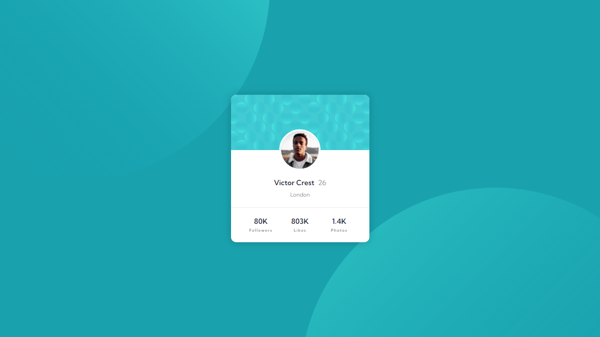

# Frontend Mentor - Profile card component

This is my solution to the [Frontend Mentor "Profile card component" challenge](https://www.frontendmentor.io/challenges/profile-card-component-cfArpWshJ).

I can see live on this [Vercel page](https://josuesn1402-profile-card-component.vercel.app).

- [Frontend Mentor - Profile card component](#frontend-mentor---profile-card-component)
  - [Screenshots](#screenshots)
  - [Details](#details)
  - [Built with](#built-with)

## Screenshots

## Details

- Built with [Live Server](https://marketplace.visualstudio.com/items?itemName=ritwickdey.LiveServer) and [Live Sass Compiler](https://marketplace.visualstudio.com/items?itemName=glenn2223.live-sass) extensions for VSCode

## Built with

    
    

